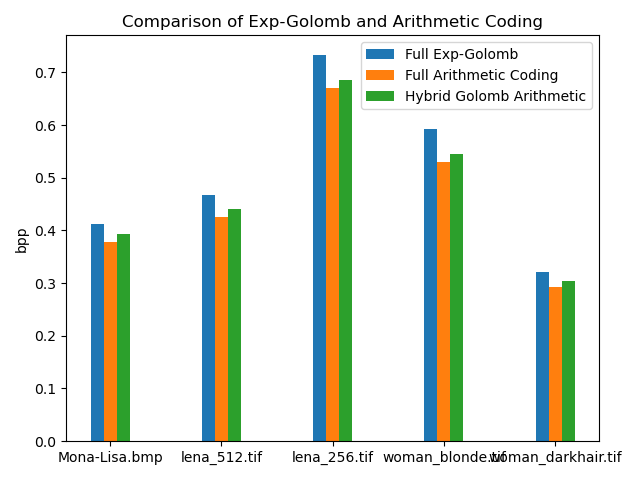

# Image Compression with Arithmetic Coding
## General Approach
### Goal
To use arithmetic coding to improve on the DCT quanitzation method of encoding an image.  
### Method
We build a state model of the DC coefficients of the entire image. On each 8x8 block in the image, we perform DCT, quantization, and run length encoding on the resulting coefficients. Normally Exp-Golomb or Huffman encoding is used, however instead arithmetic coding is used on the coefficients themselves while the run lengths are still encoded using Exp-Golomb. (Using arithmetic encoding to encode run lengths is impractical because there are many different possible run lengths, as opposed to the coefficeients which have less variability). A hybrid model is proposed to benefit from the advantages of arithmetic and Exp-Golomb encoding by choosing whichever encoding is shorter for each block.  
### Rationale
- Arithmetic encoding minimizes the amount of values that need to be encoded since one value can represent many, however the more values the encoded number represents the description length increases. Therefore the hybrid model is meant to choose the method that maximizes that tradeoff.  
- For example, in each block if there are more values in a block's runlist (when say, the image has more detail), then arithmetic encoding tends to do better since all those values are condensed into one, while with Exp-Golomb they are each encoded separately. However again, if there are too many values, then arithmetic encoding will do worse in this case. 
- For very small images, arithmetic coding performs worse since encoding the state probabilities has a more or less fixed description length no matter the image size. Therefore for smaller images, this overhead can double or triple the size compared to Exp-Golomb encodings of these images. 

## Implementation details
### Creating the state model and the probablities
We chose to implement the model in two ways: (1) where the probablity distribution is over the DC coefficients of the entire image and (2) where the probability distribution is over the binary representation of each value, i.e. the frequency of 0's and 1's. The first way produced better results, therefore this is the implementation that was chosen. Arithmetic coding performs best when the probability distribution is modeled on the sequence about to be encoded, in this case the coefficients of each block. However, the overhead of doing so would outweigh any benefit over Exp-Golomb encoding, so instead we built the model over the entire image. Although that means the probablities in each sequence are not the same as the model, they are close enough that it still performs well.
### Data type for the lower and upper bounds
Storing rational numbers with the precision needed to encode the entire block is not possible with the limitations of a floating point. Instead, we calculated the upper and lower bounds of the encoded sequence using a fraction represented as a numerator and denominator. To find the shortest bit sequence that encodes a number between these bounds, we iteratively created a binary rational number, which essentially can be stored as just the numerator (since the denominator is a standard conversion using powers of two for each digit).
### Encoding the decision between arithmetic coding and Exp-Golomb
In the encoding algorithm, the arithmetic and Exp-Golomb encodings are carried out for the specific block, and then the shorter description is chosen for the final encoding. However, the issue is how to inform the decoder to tell which encoding was used on the current sequence of bits. The best method that we found was to add an extra bit to the beginning of each sequence, 1 for arithmetic and 0 for Exp-Golomb. However, this adds 1 extra bit per block, and this overhead in the aggegrate reduces the benefit of the hybrid model. Finding a way to identify which encoding is used for each block without indicator bits would be the ideal way for the hybrid model to be built. 

## Results
We compared the results of the pure arithmetic encoding method and the hybrid encoding model to the pure Exp-Golomb method (order k=2) on 5 different images. The results shown in the graph below indicate that the pure arithmetic encoding method compresses each image moreso than the other methods. 

Without the overhead incurred from the indicator bit in the hybrid method, this method would have been the best. Either way, both methods achieved the goal of improving upon the pure Exp-Golomb method. 

## How to use the code
The code is divided into four files: <code>main.py</code>, <code>arithmetic_encoding.py</code>, <code>golomb_encoding.py</code>, and <code>utils.py</code>. To run the complete encoding scheme, as well as test the various methods, use the <code>if __name__ == '__main__':</code> in <code>main.py</code>: main from main.py. This will run on all the test images, as well as create the results graph. <code>arithmetic_encoding.py</code> contains the logic of the arithmetic coding, including the state model, and <code>golomb_encoding.py</code> contains the logic of the Exp-Golomb and Golomb-Rice encoding.

## Contributors
This implementaton was made by Jason Greenspan and Jake Korman as a final project in Yuval Kochman's Image Compression course at the Hebrew University.

## References  
General Background:
- https://en.wikipedia.org/wiki/Arithmetic_coding
- http://home.ustc.edu.cn/~xuedixiu/image.ustc/course/dip/DIP14-ch7.pdf
- http://www.cs.ucf.edu/courses/cap5015/Arithmetic_coding_modified_2005.pdf

Basic implementation:
- https://www.researchgate.net/publication/200065260_Arithmetic_Coding_for_Data_Compression
- https://www.researchgate.net/publication/318643056_New_Image_CompressionDecompression_Technique_Using_Arithmetic_Coding_Algorithm

Implementation details:
- https://marknelson.us/posts/2014/10/19/data-compression-with-arithmetic-coding.html
- https://philipstel.wordpress.com/2010/12/21/arithmetic-coding-algorithm-and-implementation-issues-2/
- http://michael.dipperstein.com/arithmetic/index.html
